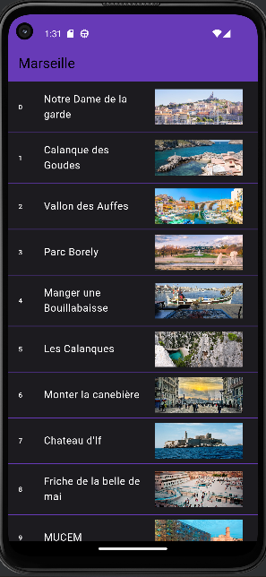
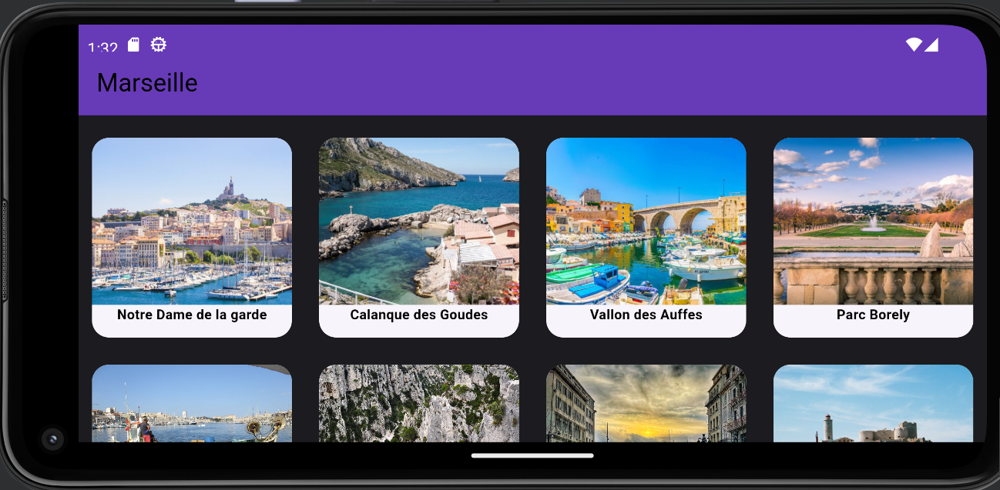
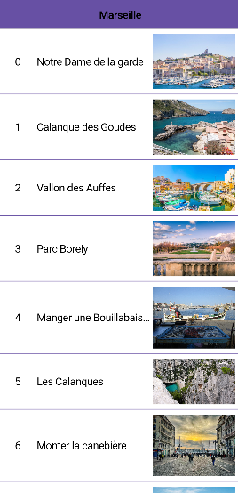
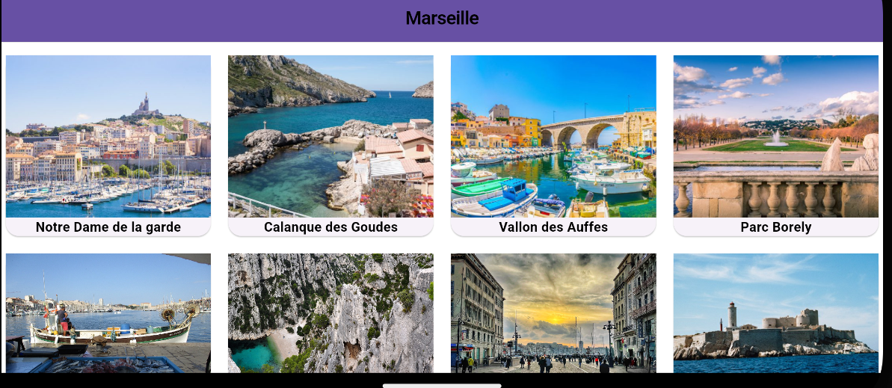

# marseille-flutter

## Description
This application lists the squares in the city of Marseille.
This application is developed for Android and IOS.

## Main features
- Display in lists or grid the squares of the city of Marseille with of images and of descriptions.
- Dark and light theme support via system configuration.

## Screenshots
### Android

### IOS

## Prerequisites
- Flutter 3.19.5 must be installed on your machine. [Link to Flutter documentation for installation](https://flutter.dev/docs/get-started/install)
- Android Studio minimum version (Iguana | 2023.2.1 Patch 2) with the Flutter plugin for development.

## Installation
1. Clone this repository on your local machine.
2. Open the project directory in Android Studio.
3. Run `flutter pub get` to install the dependencies.
4. Run the application with `flutter run`.

## Tests
The application has been tested on the following platforms:
- Android 13: Successfully tested on the Pixel 4a emulator and Pixel 4a smartphone.

## Author
This project was developed by Labas Loïc.

## License
This project is licensed under the MIT license.